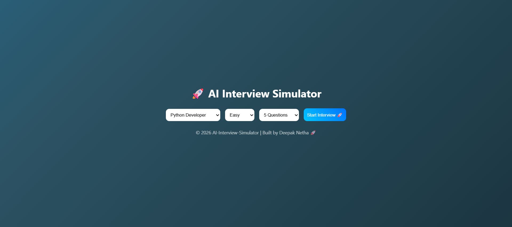

# 🚀 AI Interview Simulator

AI Interview Simulator is an intelligent web application that simulates real-time technical and HR interviews with AI-based evaluation, scoring, and feedback.

---

## 🌐 Live Demo

👉 https://ai-interview-simulator-73fn.onrender.com

---

## ✨ Features

- 🎯 Role-Based Interview (Python, Java, Frontend, Backend, Full Stack, Data Analyst, etc.)
- 📊 Difficulty Levels (Easy, Medium, Hard)
- 🧠 AI-Based Answer Evaluation
- ⏱ Real-Time Timer for Each Question
- 📈 Performance Score (Percentage)
- 🧾 Detailed Feedback per Answer
- 🧠 AI Summary of Performance
- 📊 Score Visualization using Chart.js
- 🎨 Modern UI with Animated Background
- 🔁 Restart Interview Option

---

## 🖥 Dashboard

---

## 📊 Interview Result

.png)
.png)

---

## 🛠 Tech Stack

### Backend
- Python
- FastAPI

### Frontend
- HTML
- CSS (Modern UI + Animations)
- JavaScript

### Visualization
- Chart.js

### Deployment
- Render

---

## 🧩 Project Structure
AI-Interview-Simulator/
│── app/
│ ├── main.py
│ ├── questions.py
│
│── templates/
│ └── index.html
│
│── static/
│ ├── style.css
│ └── script.js
│
│── requirements.txt
│── README.md

---

## ⚙️ How It Works

1. User selects role, difficulty level, and number of questions  
2. System fetches questions from backend  
3. User answers questions with a timer  
4. Backend evaluates answers using logic and keyword matching  
5. System generates score, feedback, and summary  
6. Frontend displays results with charts  

---

👨‍💻 Author

Deepak Netha

© 2026 AI-Interview-Simulator 

